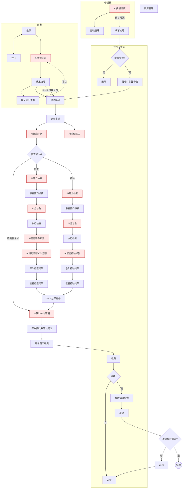
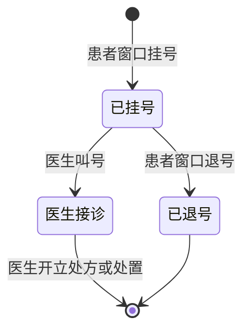
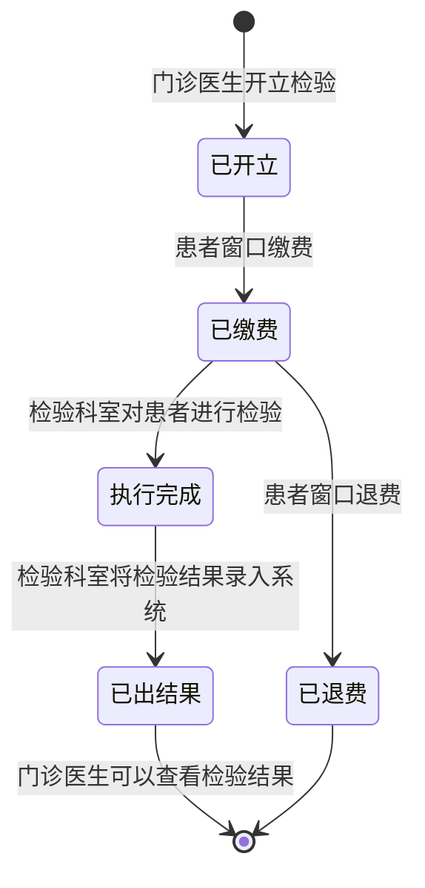
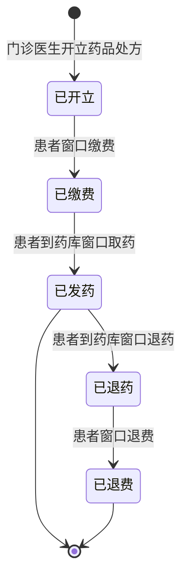
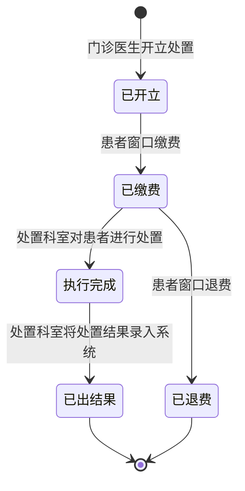

# 智慧云脑诊疗平台 — 业务流程说明

> **版本**：v1.0 | 2026-05  
> **文档索引**：[README.md](./README.md)  
> **编写原则**  
> 1. **【图】** — 手绘业务流程图（[总览](./images/biz-flow-overview.png)、[详细七泳道](./images/biz-flow-detail.png)）。  
> 2. **【态】** — 老师绘制的**关键状态图**（挂号、检查、检验、处方、处置），用于单据状态流转，**优先于泳道图中未标明的收费顺序**。  
> 3. **【补】** — 自行补充的逻辑，列入 [§五](#五自行补充清单请您核对)；**已由【态】解决的，在 §五 标注「已解决」**。  
> 4. 正文不写技术实现细节；状态枚举见 `DATABASE_DESIGN.md` §1.5；服务边界见 `MICROSERVICES.md`。

**标记说明**

| 标记 | 含义 |
|------|------|
| **【图】** | 业务流程泳道图中可见的节点或箭头 |
| **【态】** | 老师状态图中的状态与迁移 |
| **【补】** | 文档作者补充，需您核对 |
| **【AI】** | 业务流程图中的 AI 节点 |

---

## 一、图源与阅读顺序

| 顺序 | 图 | 文件 |
|------|----|------|
| 1 | 总览 | [biz-flow-overview.png](./images/biz-flow-overview.png) |
| 2 | 详细七泳道 | [biz-flow-detail.png](./images/biz-flow-detail.png) |
| 3 | 关键状态图 | 见 [§八](#八关键状态图老师提供) |

阅读顺序：**§二 费用与账户** → **§三 总览** → **§四 七泳道** → **§八 状态图** → **§4.11 完整主链** → **§6.3 补充项核对**。

---

## 二、费用、就诊账户与价目

> **您已明确的原则**：**先缴费、后享受服务（先缴费后看病）**；**不预存余额、按单支付**；挂号、药品等均 **明码标价**。  
> 下列在状态图、泳道图之上做的业务细化，均标【补】；若有不符贵院设定，请直接指出。

### 2.0.1 您已确认

| 项 | 内容 |
|----|------|
| 缴费原则 | **先缴费后看病**（先付清当期应付费用，再进入下一诊疗环节） |
| 就诊账户 | 患者拥有 **院内就诊账户**（身份、病历、待缴单等）；**不设预存余额，一期不做充值** |
| 支付方式 | **按单支付**：每笔费用（挂号费、检查/检验/处置/处方等）单独生成待缴单并结算；**线上：微信支付**（小程序）；**窗口：现金、扫码等**（收费员录入或对接扫码） |
| 价目 | 挂号、检查、检验、处置、药品等均在系统中维护 **单价/价目** |
| 挂号费示例 | **普通号 20 元**、**专家号 65 元**（实现时写入 `regist_level` 等基础表，可配置） |
| 线上挂号 | **等同「患者窗口挂号」**，**付清当笔挂号费**后 → 挂号记录 **已挂号**（§8.1） |
| 退费 | 退号、退费等按 **原支付渠道退回**（如微信原路退；窗口现金则现金退） |

### 2.0.2 支付与流水（【补】· 实现参考）

| 编号 | 补充内容 |
|------|----------|
| **补-19** | **支付流水**：每笔待缴单对应一条或多条 **支付记录**（金额、渠道、第三方单号、关联业务单 ID）；**不做余额台账、不做充值中心**。 |
| **补-20** | **挂号当场收费**：线下/线上选号别（普通/专家）后 **立即支付当笔挂号费**（微信或窗口现金等），成功后才 **已挂号**、进入叫号队列。 |
| **补-21** | **医嘱费用**：检查/检验/处置/处方 **已开立** 后，患者对 **该张待缴单** 缴费（小程序微信 / 窗口）→ **已缴费**（与 §八 状态图一致）；**未缴费不执行、不发药**。 |
| **补-26** | **扩展（非一期）**：若后续需要「就诊卡预存」，可单独增加余额字段与充值模块；当前答辩与开发以 **按单付** 为准。 |
| **补-27** | **流水可见范围**：患者看本人待缴/已付/退款；收费员查单患者并经办收费退费；医生/医技/药师仅看医嘱 **是否已缴费**；管理员可做汇总。详见 `PROJECT_REQUIREMENTS.md` §2.3.1、`DATABASE_DESIGN.md` §8.5。 |
| **补-28** | **诊疗数据存储**：病历、医嘱、医技结果、处方等 **权威数据存院内 PostgreSQL**（影像大文件存 MinIO）；患者小程序 **查看本人数据**，不以手机本地为唯一副本。隐私靠 **角色授权与患者隔离**，非「医院不存病情」。详见 `PROJECT_REQUIREMENTS.md` §2.3.2、`DATABASE_DESIGN.md` §8.6。 |
| **补-22** | **药品价格**：`drug_info` 等维护零售价；处方金额 = 各药品单价 × 数量之和。 |
| **补-23** | **退号**：「继续看诊?」选 **否** → 退号；**已收挂号费原路退回**（您已确认） |
| **补-24** | **检查/检验**：医生根据 **AI 分析 + 自身判断** 做 **条件选择**；AI 辅助，**决策在人**（您已确认） |
| **补-25** | **AI 辅助处方**：医生须在 AI 建议基础上 **可修改** 药品/用法用量等，并 **点击确认后才提交** → 处方 **已开立**（您已确认） |

---

## 三、总览业务流程（文字说明）

> 原「§二 总览」顺延为 **§三**；下图指 `biz-flow-overview.png`。

### 3.1 患者端 【图】

1. **【图】** 从「患者端」进入 →「登录」。  
2. **【图】**「登录」↔「注册」双向可跳转。  
   - **【补-1】** 新患者走「注册」实名建档并开通就诊账户；老用户「登录」。两页可互跳。  
3. **【图】** 登录 → **【AI】AI 智能问诊** → **线上挂号** → **电子病历**（查看）。  
   - **【补-14 · 您已确认】** 线上挂号 = 窗口挂号：选科室/医生/号别 → **支付挂号费（普通 20 / 专家 65）** → **已挂号**。  
4. **【图】**「电子病历」→「AI 智能问诊」有回环箭头。  
   - **【补-2】** 复诊或查看历史病历后，再次智能问诊/挂号。

### 3.2 医生端 【图】+【补】

1. **【图】**「医生端」→「登录」→「线下挂号」→「门诊」。  
   - **【补-10】** 总览图中「线下挂号」表示**患者经收费员窗口完成挂号后**，进入医生「门诊」队列；**不是**医生本人操作挂号。与详细图「挂号收费员 · 线下挂号」为同一业务在不同泳道的体现。  
2. **【图】**「门诊」↔ **【AI】AI 助理医生**（双向，会诊中可反复调用）。  
3. **【图】**「门诊」→「药房管理」、「检查|检验」；「门诊」→ 患者侧「电子病历」。  
   - **【补-11】**「药房管理」指药库日常管理职能；详细图中对患者的「发药」为取药履约环节，二者相关但不同步骤（详见 §4.8）。

### 3.3 管理员端 【图】

**【图】**「管理员端」→「登录」→ **【AI】AI 医生排班**（详细图为「AI 排班调度」）。

- **【补-3】** 排班发布决定各科室/医生可出诊时段与号源，影响「线上挂号」可选范围及收费员「线下挂号」可选医生（图中未画箭头，为业务补链）。

### 3.4 总览跨端衔接 【图】

| 起点 | 终点 | 来源 |
|------|------|------|
| 患者 · 线上挂号 | 医生 · 门诊 | 【图】 |
| 医生 · 线下挂号 | 医生 · 门诊 | 【图】 |
| 患者 · 电子病历 | 患者 · AI 智能问诊 | 【图】 |
| 门诊 | 患者 · 电子病历 | 【图】 |

### 3.5 总览独立 AI 模块 【图】

| 模块 | 图中连线 |
|------|----------|
| AI 分诊台 | → 检查\|检验 |
| 头部 CT 医学影像识别 | → AI 智能检查报告 |
| AI 智能检查报告 | ↔ 检查\|检验 |

---

## 四、详细业务流程（七泳道）

> **图源**：[biz-flow-detail.png](./images/biz-flow-detail.png)（2026-05 更新版）  
> **平台正式名称**：**「智慧云脑诊疗平台」**（英文 NST，**已确认**）；图中若曾出现「云精」等字样，以本名为准，属制图笔误。  
> 七泳道名称：**患者 · 挂号收费员 · 门诊医生 · 检查医生 · 检验医生 · 药师医生 · 管理员**。

### 4.1 管理员

| 步骤 | 节点 | 来源 | 说明 |
|------|------|------|------|
| 1 | 开始 | 【图】 | |
| 2 | AI 排班调度 | 【图】【AI】 | |
| 3 | 基础管理 | 【图】 | 科室、人员、号别等基础数据维护 |

---

### 4.2 患者

| 步骤 | 节点 | 来源 | 说明 |
|------|------|------|------|
| 1 | 开始 | 【图】 | |
| 2 | 登录 | 【图】 | 【补-1】注册/登录、就诊账户 |
| 3 | AI 智能问诊 | 【图】【AI】 | 可在挂号前采集主诉（非替代医生诊断） |
| 4 | 线上挂号 | 【图】【补-14】 | 选号别 → **付挂号费**（普通 20 / 专家 65）→ **已挂号** |
| 5 | （诊后）电子病历 / 费用查看 | 【补-4】【补-19】 | 新版详细图中患者泳道止于 **线上挂号** 后与医生侧衔接；诊后查看病历、**支付/费用流水** 走小程序能力 |

**【图】** 患者泳道可见：**登录 → AI 智能问诊 → 线上挂号**（无单独「结束」节点，与医生 **患者叫号** 衔接）。

---

### 4.3 挂号收费员

#### 4.3.1 线下挂号段

| 步骤 | 节点 | 来源 | 说明 |
|------|------|------|------|
| 1 | 开始 | 【图】 | |
| 2 | 线下挂号 | 【图】 | 登记、选科室/医生/号别（普通/专家） |
| 3 | 继续看诊? | 【图】【补-17】 | 确认是否完成本次挂号；**否** = 放弃挂号 |
| 3a | 否 → 退号 → 结束 | 【图】【补-23】 | **已退号**；挂号费 **原路退回**（微信/银行卡等原渠道） |
| 3b | 是 → 挂号并收费 | 【图】【态】【补-20】 | 收取挂号费（20/65）→ 状态 **已挂号** → 叫号队列 |

**【补-14 · 您已确认】** 与线上挂号业务等价，均对应状态图「患者窗口挂号」→ **已挂号**。  
**【补-17】**「继续看诊?」= 是否确认挂号；否则退号，对应 **已退号**。

#### 4.3.2 收费 / 退费（收费员 · 多次发生）

**【态】** 检查单、检验单、处方单、处置单各自独立：**已开立 → 患者窗口缴费 → 已缴费** 后，方可执行检查/检验/处置或发药（§八）。

| 发生时机 | 触发动作（【态】） | 收费员操作 | 失败分支 |
|----------|-------------------|------------|----------|
| 医生 **AI 开立检查** 之后 | 检查单 → **已开立** | **患者窗口缴费** → 已缴费 | 已缴费后可 **窗口退费** → 已退费 |
| 医生 **AI 开立检验** 之后 | 检验单 → **已开立** | 同上 | 同上 |
| 医生 **AI 辅助开立处方** 之后 | 处方 → **已开立** | 同上 | 退药场景见 §4.8、§8.4 |
| 医生 **开立处置** 之后 | 处置单 → **已开立** | 同上 | 同上 |

详细泳道图在 **AI 辅助开立处方** 之后画了一个「收费」节点；【态】表明可对**多张已开立单据**分别收费（**补-15**）。

| 步骤 | 节点 | 来源 | 说明 |
|------|------|------|------|
| 1 | 收费（窗口/线上） | 【图】【态】【补-21】 | 针对 **已开立** 单据；**按单** 收取当笔费用（微信 / 窗口现金等） |
| 2 | 继续?（缴费是否完成） | 【图】【补-5】【态】 | 新版详细图节点为 **「继续」**；**否** → 退费；**是** → 费用记录查询（即缴费成功） |
| 2a | 否 → 退费 | 【图】【态】 | 单据 → **已退费**（检查/检验/处置见 §8.2～8.5） |
| 2b | 是 → 费用记录查询 | 【图】 | 缴费成功后查询记录；处方链接着 **发药**（§4.8） |

---

### 4.4 门诊医生

| 步骤 | 节点 | 来源 | 说明 |
|------|------|------|------|
| 1 | 患者叫号 | 【图】 | 承接 **已挂号** 患者（线上/线下） |
| 2 | 患者自述 | 【图】 | 患者陈述病情；医生问诊、记录主诉（原稿「患者会诊」与本节点合并表述） |
| 3 | AI 智能诊断 | 【图】【AI】 | **辅助**分析建议，**不替代**医生结论（【补-24】） |
| 4 | 是否需要进入检查/检验等? | 【图】 | **医生条件选择**（【补-24】）；「等」可含其它医技，**本图仅画出检查、检验两支** |
| 4a | 需要检查 → AI 开立检查 | 【图】【AI】【态】 | 医生确认后 **已开立** → 缴费 → §4.5 |
| 4b | 需要检验 → AI 开立检验 | 【图】【AI】【态】 | 同上 → §4.6 |
| 4c | 不需要检查/检验等 | 【图】【补-6】 | **直接**进入 **AI 辅助开立处方**（不经过检查/检验泳道） |
| 4d | 需要处置 | 【态】仅 | **处置**见 §4.7 与老师处置状态图；**本版详细图未画处置泳道** |
| 5 | 查看检查结果 | 【图】 | 检查科录入后回到本泳道 |
| 6 | 查看检验结果 | 【图】 | 检验科录入后回到本泳道 |
| 7 | AI 辅助开立处方 | 【图】【AI】【态】 | AI 生成处方 **建议/草稿** → 医生 **修改、确认提交**【补-25】→ 处方 **已开立** → 缴费（§4.3.2） |
| 8 | （挂号记录收束） | 【态】 | 医生 **开立处方或处置** 后，当次挂号可视为结束（§8.1） |

**【补-24 · 您已确认】人机分工（检查 / 检验 / 处置）**

- **AI**：智能诊断、辅助生成检查/检验/处置申请等，提供 **分析、建议、草稿**。  
- **医生**：结合 AI 与自身诊断，在「是否需要检查/检验单」等处做 **条件选择**；对 AI 草稿 **可改、须确认后提交**。  
- **原则**：**AI 辅助，决策在人**。

**【补-25 · 您已确认】AI 辅助处方（与上统一）**

- **AI**：根据病历与诊断辅助生成 **处方建议**（药品、用法、用量、频次等草稿）。  
- **医生**：在界面上 **查看、增删改** AI 建议的药品与医嘱内容，确认无误后 **点击「确认提交」/「开立处方」**。  
- **系统**：仅在医生确认后，处方单状态变为 **已开立**（对应状态图「门诊医生开立药品处方」），再进入缴费、发药。  
- **禁止**：AI 自动生成处方即直接 **已开立**，未经医生确认。

**【补-6】** 对应图中 **4c**：医生判断 **不需要进入检查/检验等** 时，**不走** 检查医生/检验医生泳道，**直接** 到 **AI 辅助开立处方**（仍须医生修改并确认提交【补-25】）。  
**不等于**「不需要开药」，而是 **不需要先做检查/检验**。

**【补-7 · 您已确认】** 若医生判断 **两项都需要**，可同时开立检查与检验，两路并行缴费、执行；**不是** AI 默认双开，而是医生在分支上的选择结果。

**【补-8】** 汇合规则（医生开立几项，等几项结果）：  
- 仅检查 → 查看检查结果后开处方；  
- 仅检验 → 查看检验结果后开处方；  
- 检查+检验 → 两项均 **已出结果** 后再开处方。

**【图】** 总览中「门诊」↔「AI 助理医生」：会诊中可随时唤起，与步骤 3 并存，均为 **辅助**，不替代医生终审。

---

### 4.5 检查医生

| 步骤 | 节点 | 来源 | 说明 |
|------|------|------|------|
| 1 | （入）AI 开立检查 | 【图】 | |
| 2 | （前置）患者窗口缴费 | 【态】 | 检查单须 **已缴费** 后方可执行 |
| 3 | AI 分诊台 | 【图】【AI】 | 分配检查队列/诊室 |
| 4 | 执行检查 | 【图】【态】 | 检查单 → **执行完成** |
| 5 | AI 智能影像报告 | 【图】【AI】 | |
| 6 | AI 辅助诊断 | 【图】【AI】 | 含：**头部 CT 影像识别**、**肺部 CT 影像识别**、**肿瘤分割** |
| 7 | 导入检查结果 | 【图】【态】 | 检查单 → **已出结果**（图中用语为「导入」） |
| 8 | （出）查看检查结果 | 【图】【态】 | 门诊医生查看后，该检查单一单生命周期结束 |

---

### 4.6 检验医生

| 步骤 | 节点 | 来源 | 说明 |
|------|------|------|------|
| 1 | （入）AI 开立检验 | 【图】 | |
| 2 | （前置）患者窗口缴费 | 【态】 | 检验单须 **已缴费** |
| 3 | AI 分诊台 | 【图】【AI】 | |
| 4 | 执行检验 | 【图】【态】 | 检验单 → **执行完成** |
| 5 | AI 智能检验报告 | 【图】【AI】 | |
| 6 | 录入检验结果 | 【图】【态】 | 检验单 → **已出结果** |
| 7 | （出）查看检验结果 | 【图】【态】 | 回到门诊医生 §4.4 步骤 6 |

---

### 4.7 处置医生（仅【态】；七泳道总览/详细图未单独画出）

| 步骤 | 节点 | 来源 | 说明 |
|------|------|------|------|
| 1 | （入）门诊医生开立处置 | 【态】 | 处置单 **已开立** |
| 2 | 患者窗口缴费 | 【态】 | → **已缴费** |
| 3 | 处置科室对患者进行处置 | 【态】 | → **执行完成** |
| 4 | 处置科室将处置结果录入系统 | 【态】 | → **已出结果** |
| 5 | （出）门诊医生查看处置结果 | 【补-16】 | 与查看检查/检验结果对称，医生站可查看处置结果 |

---

### 4.8 药师医生

> 新版详细图泳道名为 **「药师医生」**（非「药库医生」）；**药库管理** 仍为库管职能节点。

| 步骤 | 节点 | 来源 | 说明 |
|------|------|------|------|
| 1 | （入）发药 | 【图】【态】 | 处方须 **已缴费**；患者到药房窗口取药 → **已发药** |
| 2 | 发药核对通过? | 【补-5】【补-9】 | 泳道「是否需要」；与状态图「已发药」后正常结束或退药链对应 |
| 2a | 否 → 退药 → 退费 | 【图】【态】 | **已发药 → 已退药 → 已退费**（§8.4） |
| 2b | 是 → 结束 | 【图】【态】 | 处方单一单生命周期结束 |

**【态】** 处方状态链：**已开立 → 已缴费 → 已发药**（正常）；或 **已发药 → 已退药 → 已退费**（退药）。

**【补-9】** 泳道「发药核对通过?」：理解为发药员确认可发药；若否，走退药→退费，与【态】一致。

**【补-11】** **药库管理**（【图】）：入库、库存等，与单次「发药」并行。

---

### 4.9 泳道图与状态图的关系（说明，非新业务流程）

| 现象 | 说明 |
|------|------|
| 详细泳道只在处方后画「收费」 | 【态】要求检查/检验/处方/处置均须 **先缴费再执行**；泳道图是简化画法 |
| 七泳道无「处置」角色 | 【态】有完整处置状态图；业务上仍须纳入（§4.7） |
| 挂号「继续看诊?」 | 【态】挂号侧仅 **已挂号 / 已退号 / 医生接诊→结束**；「继续看诊」可理解为是否确认进入 **已挂号**（【补-17，待您核对】） |

---

### 4.10 跨角色协作（【图】+【态】+【补】）

```
【管理员】AI 排班调度 → 基础管理

【患者】登录 → AI 智能问诊 → 线上挂号【态：已挂号】→ 电子病历查看 → 结束

【挂号收费员】
    线下挂号 → 继续看诊?
        ├─ 否 → 退号【态：已退号】→ 结束
        └─ 是 → 挂号【态：已挂号】→ 患者叫号队列
    （多次）缴费/退费  ← 各张【已开立】单据；按单支付（§4.3.2、§二）

【门诊医生】叫号 → 患者自述 → AI 智能诊断（辅助）→ 是否需要检查/检验等?【图】【补-24】
    ├─ 需要检查 → AI 开立检查 → … → 导入检查结果 → 查看检查结果
    ├─ 需要检验 → AI 开立检验 → … → 录入检验结果 → 查看检验结果
    ├─ 可同时需要检查+检验【补-7】
    ├─ 不需要检查/检验等【图】【补-6】→ 直接 AI 辅助处方 → 医生确认【补-25】
    └─ 处置【态】本图未画泳道，见 §4.7
              ↓
    医生确认提交处方 →【态：已开立】→ 收费 → 继续?【图】→ 费用记录查询 → 药师发药 →【态：已发药】
              │                                      ├─ 退药 → 已退药 → 已退费
              └【态】医生开立处方或处置后，当次挂号生命周期可结束

【总览图】电子病历 ⇢ AI 智能问诊；门诊 ◄──► AI 助理医生
```

---

### 4.11 完整主链（【图】+【态】+【补】）

1. **【补-3】** 管理员：AI 排班调度 → 基础管理（号别含普通 20 / 专家 65）。  
2. **患者**：登录/注册【补-1】→ AI 智能问诊 → **线上挂号并付挂号费【补-14/20】**（微信）→ **已挂号**；或收费员 **线下挂号并收费**（现金等）→ **已挂号** / 退号 **原路退【补-23】**。  
3. **门诊医生**：叫号 → **医生接诊** → 会诊（AI 助理，辅助）→ **AI 智能诊断（辅助）** → **医生条件选择** 是否及何种检查/检验/处置【补-24】。  
4. **医技/处置**（医生勾选几项则走几项，可同时【补-7】）：医生确认开立 → **已开立** → **缴费【补-21】** → **已缴费** → 执行 → **已出结果** → 医生查看【补-8/16】。  
5. **【补-6】** 医生判断不需要医技/处置则直接开处方（AI 辅助、医生确认）。  
6. **处方**：AI 辅助草稿 → **医生修改并确认提交【补-25】** → **已开立** → **缴费** → **已缴费** → **发药**（或退药退费）。  
7. **【态】** 医生 **开立处方或处置** 后，当次挂号结束。  
8. 患者查病历、复诊再问诊【补-2】。

---

## 五、图中 AI 节点清单 【图】

| 序号 | 节点 | 位置 |
|------|------|------|
| 1 | AI 智能问诊 | 患者 |
| 2 | AI 医生排班 / AI 排班调度 | 管理员 |
| 3 | AI 助理医生 | 医生总览 · 门诊 |
| 4 | AI 智能诊断 | 门诊医生 |
| 5 | AI 开立检查 / AI 开立检验 | 门诊医生 |
| 6 | AI 辅助开立处方 | 门诊医生 |
| 7 | AI 分诊台 | 检查/检验 |
| 8 | AI 智能影像报告 | 检查 |
| 9 | AI 辅助诊断（头部 CT、肺部 CT、肿瘤分割） | 检查 |
| 10 | AI 智能检验报告 | 检验 |
| 11 | 头部 CT 医学影像识别、AI 智能检查报告 | 总览独立模块 |

---

## 六、自行补充清单（请您核对）

### 6.1 您已口头确认（已写入 §二、正文）

| 编号 | 结论 |
|------|------|
| — | **平台正式名称**：**智慧云脑诊疗平台**（NST） |
| — | **先缴费后看病**；**不预存、按单付**（微信 / 窗口现金等） |
| **补-19** | **按单支付 + 支付流水**；一期 **不做充值、不做余额** |
| **补-27** | **流水可见范围**（患者本人 / 收费员 / 医护仅缴费状态 / 管理员汇总） |
| **补-26** | 预存余额为 **扩展项**，非本期范围 |
| — | 挂号、药品等 **明码标价**；**普通号 20 元、专家号 65 元** |
| **补-14** | **线上挂号** = **患者窗口挂号** → **已挂号**（须先付挂号费） |
| **补-23** | 退号时挂号费 **原路退回**（微信/银行卡等原支付渠道） |
| **补-24** | **检查/检验为医生条件选择**：结合 **AI 分析 + 医生主观判断** 决定是否开立、开立哪一类；**AI 辅助，决策在人** |
| **补-25** | **AI 辅助处方**：医生可改 AI 草稿，**确认后提交** 方为已开立 |
| **补-7** | 病情需要时可 **同时** 选检查与检验；非系统自动双开，仍由医生判断 |

### 6.2 已由老师【态】图确认

| 编号 | 结论 |
|------|------|
| **补-13** | 检查/检验/处方/处置：**已开立 → 缴费 → 已缴费** 后执行/发药 |
| **补-5** | 收费后 **「继续」?= 缴费是否完成**；否→退费，是→费用记录查询（新版【图】已标明） |
| **补-9** | **已发药 → 已退药 → 已退费** |
| **补-12** | **处置纳入**主流程 |

### 6.3 经验补充（已写入正文，请您抽查是否合适）

| 编号 | 补充内容 | 请您核对 |
|------|----------|----------|
| **补-1** | 注册=实名建档+就诊账户；登录=老用户 | |
| **补-2** | 电子病历→问诊 = 复诊/查历史后再问 | |
| **补-3** | 排班发布约束可挂科室、医生、号别与时段 | |
| **补-4** | 患者「结束」= 当次流程结束，账号仍可用 | |
| **补-6** | 不需要检查/检验/处置 → 直接开处方 | |
| **补-8** | 医生开立几项医技，须等几项 **已出结果** 后再开处方 | |
| **补-10** | 总览「线下挂号」= 收费员办理；医生端=患者已入队 | |
| **补-11** | 药房管理=库存职能；发药=单次取药 | |
| **补-15** | 收费员按「本次就诊待缴列表」**逐单或合并** 结算；渠道为 **微信 / 现金等**（按单付，非余额扣款） | |
| **补-16** | 处置 **已出结果** 后，医生 **查看处置结果**（同检查/检验） | |
| **补-17** | 「继续看诊?」= 是否确认挂号；否=退号→**已退号** | |
| **补-18** | 处方 **已缴费未发药** 可申请退费（状态图未画，常见业务） | |
| **补-19** | 每笔费用 **支付流水**；不做充值 | ✓ 已按您确认调整 |
| **补-20** | **挂号当场收挂号费** 后才是 **已挂号** | |
| **补-21** | 医嘱 **按单缴费**（微信/窗口），与【态】「患者窗口缴费」一致 | |
| **补-22** | 药品按 `drug_info` 单价计价；**开立处方时预扣 `stock_qty`**，库存不足则医生无法开立（提示「该药品库存不足」）；退费、药师驳回、退药后 **回增库存**；发药不再二次扣减。 |

---

## 七、Mermaid（泳道主链 · 含【态】缴费节点）



---

## 八、关键状态图（老师提供 · 与缴费关系）

> 以下文字**仅复述状态图**；归档 PNG 见 `docs/images/state-*.png`。  
> 建议库表字段 `status` 与下表枚举一致（实现时再定英文名）。

### 8.1 挂号患者状态图

**原图**：[state-register.png](./images/state-register.png)

| 当前状态 | 触发动作 | 下一状态 |
|----------|----------|----------|
| （初始） | 患者窗口挂号 | **已挂号** |
| **已挂号** | 医生叫号 | **医生接诊** |
| **已挂号** | 患者/窗口退号（**医生未叫号**） | **已退号** |
| **已挂号 / 医生接诊** | 当日 **21:00** 系统自动关单（未到或未结束） | **看诊结束**（`remark=AUTO_DAY_CLOSE`，不退挂号费） |
| **医生接诊** | 医生开立处方或处置 / 手动结束看诊 | **看诊结束** |
| **已退号** | — | **（终态）** |

**文字说明**：一次「挂号」记录从 **患者窗口挂号（或线上等价渠道）并支付挂号费【补-14/20】** 后开始，处于 **已挂号**；医生叫号后进入 **医生接诊**，**不可再退号**。医生完成 **处方或处置** 开立或手动结束看诊后，该挂号记录生命周期结束。**已挂号且未叫号**时可退号退费。**当日 21:00** 仍为已挂号或接诊中的记录，系统自动关单为看诊结束（不退挂号费）。**待支付**占号 **10 分钟**内须完成支付，否则自动取消并释放号源。退号则进入 **已退号** 终态，挂号费按 **补-23** 退回。

**与【补】的关系**：状态图迁移名「患者窗口挂号」在实现上包含 **挂号费已到账**（普通 20 / 专家 65），体现 **先缴挂号费、后看诊**。

与需求表 `register.visit_state` 对照建议：1 已挂号、2 医生接诊、3 看诊结束（开立处方或处置后）、4 已退号。



---

### 8.2 医生开立检查状态图

**原图**：[state-check.png](./images/state-check.png)

| 当前状态 | 触发动作 | 下一状态 |
|----------|----------|----------|
| （初始） | 门诊医生开立检查 | **已开立** |
| **已开立** | 患者窗口缴费 | **已缴费** |
| **已缴费** | 检查科室对患者进行检查 | **执行完成** |
| **已缴费** | 患者窗口退费 | **已退费** |
| **执行完成** | 检查科室将检查结果录入系统 | **已出结果** |
| **已出结果** | 门诊医生可以查看检查结果 | **（终态）** |
| **已退费** | — | **（终态）** |

**约束**：须 **已缴费** 后才能 **执行完成**；**已退费** 仅出现在 **已缴费** 之后（未缴费不能按此图退费）。


---

### 8.3 医生开立检验状态图

**原图**：[state-inspection.png](./images/state-inspection.png)

| 当前状态 | 触发动作 | 下一状态 |
|----------|----------|----------|
| （初始） | 门诊医生开立检验 | **已开立** |
| **已开立** | 患者窗口缴费 | **已缴费** |
| **已缴费** | 检验科室对患者进行检验 | **执行完成** |
| **已缴费** | 患者窗口退费 | **已退费** |
| **执行完成** | 检验科室将检验结果录入系统 | **已出结果** |
| **已出结果** | 门诊医生可以查看检验结果 | **（终态）** |
| **已退费** | — | **（终态）** |

结构与 **§8.2 检查** 相同，执行角色为检验科室。



---

### 8.4 医生开立处方状态图

**原图**：[state-prescription.png](./images/state-prescription.png)

> **与【补-25】的关系**：状态图迁移「门诊医生开立药品处方」在系统中对应医生 **审阅 AI 建议（可修改）并确认提交** 后的动作，非 AI 自动开立。  
> **与【补-22】库存**：**已开立（10）** 时即对 `drug_info.stock_qty` **预扣**；任意药品 `quantity > stock_qty` 则 **整单拒绝**，医生端提示 **「该药品库存不足: {药名}，当前库存 {n}」**。缴费、发药 **不再扣库存**；**退费 / 药师驳回 / 退药** 按明细 **回增库存**（详见 [`REFACTORING §4.3.1`](./REFACTORING_DESIGN_PATTERNS.md#431-库存联动与-sm2-绑定)）。

| 当前状态 | 触发动作 | 下一状态 | 库存 |
|----------|----------|----------|------|
| （初始） | 门诊医生开立药品处方（**含：确认提交 AI 辅助处方【补-25】**）；**库存须充足** | **已开立** | **预扣** |
| **已开立** | 患者窗口缴费 | **已缴费** | 不变 |
| **已开立** | 患者窗口退费（未发药） | **已退费** | **回增** |
| **已缴费** | 患者到药库窗口取药 | **已发药** | 不变 |
| **已缴费** | 药师驳回并退费 | **药师驳回(15)** | **回增** |
| **药师驳回** | 医生修改并重提 | **已开立** | **按新明细预扣** |
| **已缴费** | 患者窗口退费（未发药） | **已退费** | **回增** |
| **已发药** | — | **（终态）** | — |
| **已发药** | 患者到药库窗口退药 | **已退药** | **回增** |
| **已退药** | 患者窗口退费 | **已退费** | 不变（退药已回增） |
| **已退费** | — | **（终态）** | — |

**说明**：状态图**未画**「已开立未缴费直接取消」或「已缴费未发药退费」路径；若业务需要，须您另行确认后补充（【补-18，待您核对】）。上表 **退费/驳回/退药** 路径与【补-18】及现网 `RefundService` / 药师驳回一致。



---

### 8.5 医生开立处置状态图

**原图**：[state-disposal.png](./images/state-disposal.png)

| 当前状态 | 触发动作 | 下一状态 |
|----------|----------|----------|
| （初始） | 门诊医生开立处置 | **已开立** |
| **已开立** | 患者窗口缴费 | **已缴费** |
| **已缴费** | 处置科室对患者进行处置 | **执行完成** |
| **已缴费** | 患者窗口退费 | **已退费** |
| **执行完成** | 处置科室将处置结果录入系统 | **已出结果** |
| **已出结果** | — | **（终态）** |
| **已退费** | — | **（终态）** |

结构与 **§8.2 检查** 相同；**已出结果** 后状态图未画「医生查看」迁移，见 **补-16**。



---

## 九、泳道与微服务映射（实现对照）

| 泳道 / 业务 | 主责微服务 | 说明 |
|-------------|------------|------|
| 患者、挂号收费、门诊医生、药师、处置开立 | `hospital-his` | 七泳道中 HIS 侧能力 |
| 处置科执行与结果 | `hospital-disposal` | 表 `disposal_request`（执行侧 status 30/40） |
| 检验科执行与结果 | `hospital-lis` | 表 `inspection_request` |
| 检查科、影像上传与 CNN | `hospital-pacs` + `hospital-ai` | 表 `check_request`、`imaging_study` |
| 字典、排班 | `hospital-management` | 管理端维护 |
| AI 问诊/助理 | `hospital-ai-bridge` | P4+，不影响主链 |

技术栈与接口：**[README.md](./README.md)** → `MICROSERVICES.md`、`API.md` §〇。

---

## 十、修订记录

| 版本 | 日期 | 说明 |
|------|------|------|
| v2.9 | — | 补-27 流水可见范围；缴费定稿：不预存、按单付 |
| v1.0 | 2026-05 | 统一文档头；§九 改为泳道-微服务映射；对齐 `docs/README.md` |
