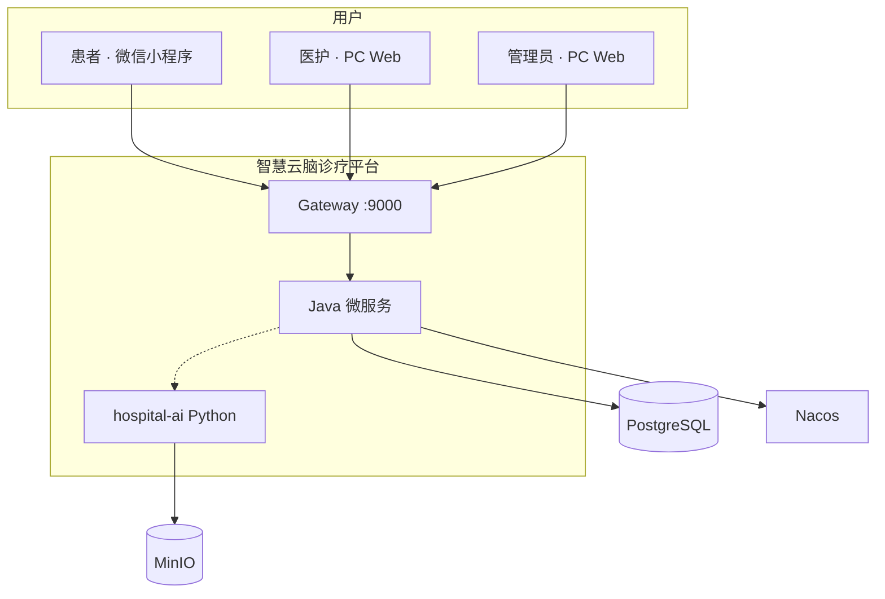
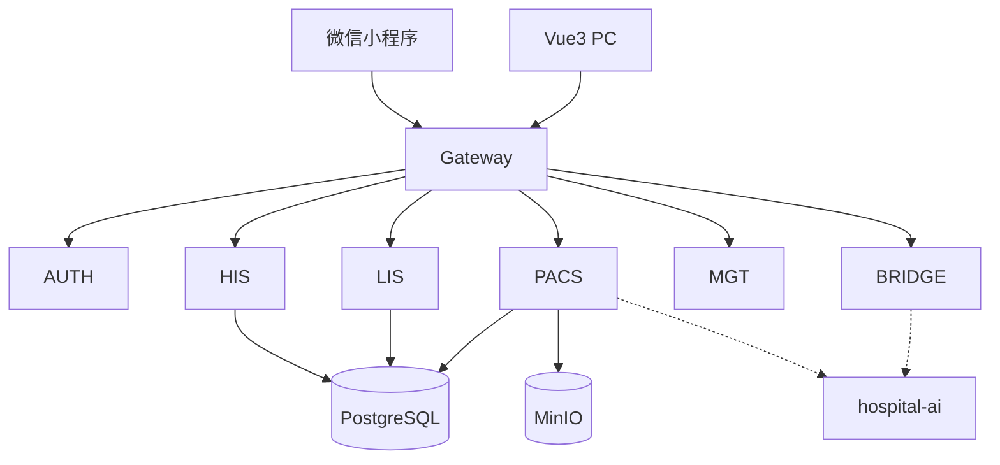

# 智慧云脑诊疗平台 — 微服务划分与边界说明书

> **文档性质**：微服务架构 **定稿**（自项目启动即按微服务实现，不采用「先单体后拆分」）。  
> **文档索引**：[README.md](./README.md)（权威范围、术语、端口、阅读顺序）  
> **关联**：`API.md`、`DATABASE_DESIGN.md` §1.4、`PROJECT_REQUIREMENTS.md` §0.1  
> **架构图与时序**：见本文 **§八**（原 TECH_ARCHITECTURE 已并入）  
> **版本**：v1.3 | 2026-05  
> **老师口径（已确认）**：HIS / LIS / PACS **三个子系统各为一个 Java 微服务**；PACS 涉及 CNN 的部分由 **Python（FastAPI）** 独立部署；Java 微服务上线形态为 **jar**；开发期允许多进程本地联调。

---

## 一、服务总览

### 1.1 一共拆成几个服务？

| 类别 | 数量 | 说明 |
|------|------|------|
| **业务子系统（课件三系统）** | **3** | `hospital-his`、`hospital-lis`、`hospital-pacs` |
| **平台能力（Java）** | **3** | `hospital-gateway`、`hospital-auth`、`hospital-management` |
| **AI 能力** | **2** | `hospital-ai-bridge`（Java · Spring AI）、`hospital-ai`（Python · FastAPI · CNN） |
| **共享库（非进程）** | **1** | `hospital-common`（jar 依赖，不单独运行） |
| **可独立启动进程合计** | **8 个 Java + 1 个 Python** | 另加 PostgreSQL、Nacos、MinIO 等基础设施 |

### 1.3 单体「子模块」与微服务「进程」对照

老师口径：单体时 **一个工程** 内按 HIS/LIS/PACS 分 **逻辑模块**，其下再有 patient、doctor、pharmacy 等 **子模块（包）**。

| 单体（一个 jar） | 微服务（本项目） | 说明 |
|------------------|------------------|------|
| `his` 逻辑模块 | **`hospital-his` 进程** | 患者/门诊/收费/药房等 = his **内部包**，**不再**拆成多个 jar |
| `lis` 逻辑模块 | **`hospital-lis` 进程** | 检验执行与结果 |
| `pacs` 逻辑模块 | **`hospital-pacs` 进程** + `hospital-ai` | Java 管流程；CNN 在 Python |
| `common` 工具包 | `hospital-common` | 依赖 jar，不启动 |
| — | gateway / auth / management / ai-bridge | 平台与 AI 能力，非课件三系统 |

**结论**：当前 **8+1 进程已够**，无需把 pharmacy、registrar 等再拆成独立微服务。

```text
                         ┌─────────────────────────────────────┐
                         │     hospital-gateway  :9000          │
                         │     （对外唯一 HTTP 入口）            │
                         └──────────────────┬──────────────────┘
                                            │ Nacos 发现
        ┌───────────────┬───────────┬───────┴───────┬───────────────┐
        ▼               ▼           ▼               ▼               ▼
   hospital-auth   hospital-his  hospital-lis  hospital-pacs  hospital-management
      :9101           :9102         :9103         :9104            :9105
        │               │             │             │                │
        │               │             │             ├──────HTTP──────┼──► hospital-ai-bridge :9106
        │               │             │             │                │
        │               │             │             └──────HTTP──────┘──► hospital-ai (FastAPI) :8000
        └───────────────┴─────────────┴─────────────┴────────────────┘
                                    PostgreSQL（共享库 hospital）
                                    MinIO（影像对象）
```

### 1.2 与「一体化平台」的关系

| 维度 | 定稿 |
|------|------|
| 产品 | **一个**智慧云脑诊疗平台 |
| 数据 | **一个** PostgreSQL 业务库（`hospital`），各服务按 **表归属** 读写 |
| 对外入口 | **一个** Gateway（`:9000`） |
| 运行 | **多个** jar 进程，可单独启停，实现 **业务级故障隔离** |

---

## 二、各服务职责与边界（核心）

### 2.1 `hospital-gateway`（平台 · 网关）

| 项 | 内容 |
|----|------|
| **端口** | 9000 |
| **职责** | 路由、JWT 校验（或与 auth 协作）、跨域、限流（可选） |
| **不做** | 业务逻辑、直接访问数据库 |
| **依赖** | Nacos（发现下游服务） |

---

### 2.2 `hospital-auth`（平台 · 认证）

| 项 | 内容 |
|----|------|
| **端口** | 9101 |
| **职责** | **统一 Token 签发中心**：医护登录、**患者 Token（internal）**、刷新 Token；JWT 校验规则/公钥 |
| **对外 API** | `/api/v1/auth/staff/login`、`/token/refresh` 等（**不**对外提供患者微信登录） |
| **内部 API** | `POST /internal/token/patient`（仅 **his** 调用，见 ADR-001） |
| **独占表** | `sys_user`（写）；读 `employee`（校验账号） |
| **不做** | 微信 code2session、**不写** `patient` / `patient_wechat`；无挂号/病历业务 |

---

### 2.3 `hospital-his`（业务 · 门诊信息系统 HIS）

对应课件 **HIS**：门诊主业务 + 患者端 + 挂号收费 + 门诊医生 + 药师发药 + **处置**（处置属门诊医嘱，不单独成第四个子系统）。

| 项 | 内容 |
|----|------|
| **端口** | 9102 |
| **面向角色** | 患者（小程序）、门诊医生、挂号收费员、药师、处置医生（处置开立与结果查看中的门诊侧） |
| **Gateway 路由前缀** | `/api/v1/patient/**`、`/api/v1/his/**`、`/api/v1/doctor/**`（门诊）、`/api/v1/pharmacy/**`、`/api/v1/registrar/**`（可与 his 合并前缀） |

#### 内部模块（包结构建议）

| 模块包名 | 功能 | 典型 API 前缀 |
|----------|------|----------------|
| `patient` | **微信登录入口**（落库后 Feign auth 取 Token）、挂号、待缴/支付、病历与费用查看 | `/api/v1/patient/**`（登录：`/patient/auth/wechat`） |
| `outpatient` | 叫号、接诊、病历 CRUD、确诊 | `/api/v1/doctor/**` |
| `order` | **开立**检查/检验/处置/处方（医嘱下达） | `/api/v1/doctor/orders/**` |
| `pharmacy` | 发药、退药（已缴费处方） | `/api/v1/pharmacy/**` |
| `registrar` | 窗口挂号、退号、收费/退费、患者费用查询 | `/api/v1/registrar/**` 或 `/admin/charge/**` |
| `disposal` | 处置医嘱开立、门诊侧查看处置结果 | 合并在 `order` 或 `outpatient` |

#### 独占写权限表（主）

`patient`、`patient_wechat`、`register`、`medical_record`、`medical_record_disease`、`prescription`、`prescription_item`、`ai_prescription_draft`、`disposal_request`（开立与门诊侧状态）、`bill`、`payment_record`、`payment_bill`、`refund_record`（患者支付与窗口收费路径）。

#### 与其它服务边界

| 方向 | 规则 |
|------|------|
| → **lis** | 门诊医生 **开立检验** 后，通过 **Feign** 调用 `hospital-lis` 创建/激活检验申请（或写库后发领域事件；**禁止**在 lis 包外直接改 `inspection_request.status` 为已执行） |
| → **pacs** | 开立 **检查** 后 Feign 调 `hospital-pacs`；患者 **上传影像** 经 **`/api/v1/pacs/**`**（ADR-002），his 只读结果 |
| → **management** | 读字典：科室、号别、药品、医技项目价目（Feign 或本地缓存） |
| → **ai-bridge** | 门诊 AI 助理、处方草稿（P4+，Feign + SSE 由 bridge 提供） |
| **不做** | 检验科执行与结果录入（归 lis）；检查执行、影像任务、CNN 回调（归 pacs） |

---

### 2.4 `hospital-lis`（业务 · 检验信息系统 LIS）

| 项 | 内容 |
|----|------|
| **端口** | 9103 |
| **面向角色** | 检验科医生（`LAB_DOCTOR`） |
| **Gateway 前缀** | `/api/v1/lis/**` |

#### 职责

- 检验申请 **待执行队列**（状态 ≥ 已缴费）
- 执行登记、**录入检验结果**
- 结果 **回传 HIS**：更新 `inspection_request` 为已出结果；通知门诊医生（接口或状态轮询）

#### 独占写权限表

`inspection_request`（**全生命周期写**归 lis，除「开立」字段由 his 创建时写入）。

#### 边界

| 允许 | 禁止 |
|------|------|
| 读 `register`、`patient` 摘要（Feign 调 his 或只读 DB） | 开立处方、修改 `medical_record` |
| 改检验单状态、结果字段 | 修改 `check_request`、操作 MinIO 影像 |

---

### 2.5 `hospital-pacs`（业务 · 检查/影像信息系统 PACS · Java 部分）

| 项 | 内容 |
|----|------|
| **端口** | 9104 |
| **面向角色** | 检查科医生（`CHECK_DOCTOR`） |
| **Gateway 前缀** | `/api/v1/pacs/**` |

#### 职责（Java）

- 检查申请队列、执行检查、**录入文字结果**、维护 `imaging_study` 任务
- 接收 **MinIO** 原图/结果图路径；**异步调用** `hospital-ai`（FastAPI）做 CNN
- CNN 完成后更新 `imaging_study`、`check_request` 结果；供 **his** 查看检查/影像报告

#### 独占写权限表

`check_request`（检查单全生命周期写，开立字段由 his 创建）、`imaging_study`。

#### 与 Python 边界

| 层 | 服务 | 职责 |
|----|------|------|
| 流程与状态 | **hospital-pacs（Java）** | 任务创建、缴费校验、调 AI、写库、对前端提供查询 |
| 算法推理 | **hospital-ai（Python FastAPI）** | 预处理（滤波/形态学等）、CNN 推理、VTK 可视化产物（可选）；**不经过 Gateway 对外** |

---

### 2.6 `hospital-management`（平台 · 管理）

| 项 | 内容 |
|----|------|
| **端口** | 9105 |
| **面向角色** | 系统管理员（`ADMIN`） |
| **Gateway 前缀** | `/api/v1/admin/**` |

#### 职责

- 科室、员工、号别、结算类别、排班（P5 + Timefold）
- 药品字典、医技项目字典、疾病字典维护
- 统计报表（一期可选）

#### 独占写权限表（主）

`department`、`employee`、`regist_level`、`settle_category`、`scheduling`、`drug_info`、`disease`、`medical_technology`。

#### 边界

**不做** 当日门诊接诊、不直接发药、不录入检验/检查结果。

---

### 2.7 `hospital-ai-bridge`（AI · 大模型 Java）

| 项 | 内容 |
|----|------|
| **端口** | 9106 |
| **Gateway 前缀** | `/api/v1/ai/**` |
| **职责** | Spring AI：智能问诊、医生助理 SSE、RAG（pgvector）、排班建议（P5） |
| **P1～P3** | 允许 **STUB**（50301） |
| **故障隔离** | 关停后 **his 门诊主链不受影响** |

---

### 2.8 `hospital-ai`（AI · 影像 Python）

| 项 | 内容 |
|----|------|
| **技术** | **Python 3.10+ · FastAPI · PyTorch**（老师提及 Flask，本项目定稿 **FastAPI**，同类 HTTP 服务） |
| **端口** | 8000（内网） |
| **注册 Nacos** | **否**（可选）；由 **pacs** 通过配置 `hospital-ai.base-url` 调用 |
| **职责** | 从 MinIO 读影像 → 预处理 → CNN → 写回结果图/JSON 报告；回调 **pacs** 内部接口 |
| **不做** | 挂号、收费、医嘱开立 |

---

## 三、服务间调用关系

### 3.1 调用方式定稿

| 场景 | 方式 |
|------|------|
| 前端 → 后端 | **仅 HTTPS/HTTP → Gateway** |
| Java → Java | **OpenFeign**（首选）；紧急调试可用 RestTemplate |
| pacs → Python | **WebClient/RestTemplate 异步** + 超时 + 失败写 `imaging_study.FAILED` |
| 跨服务需要患者信息 | **Feign 调 his**，避免 lis/pacs 随意扩 scope 写 his 表 |
| 共享库 | 允许 **只读** 他库；**写** 必须遵守 §二 表归属 |

### 3.2 Feign 依赖图（建议）

```text
hospital-his  ──► hospital-auth（**POST /internal/token/patient** 签发患者 Token）
              ──► hospital-management（字典缓存）
              ──► hospital-lis（创建检验单后的通知，可选）
              ──► hospital-pacs（创建检查单后的通知，可选）
              ──► hospital-ai-bridge（P4+）

hospital-lis  ──► hospital-his（读患者/挂号摘要，可选）
              ──► hospital-auth

hospital-pacs ──► hospital-his（读医嘱/患者摘要，可选）
              ──► hospital-ai（HTTP 推理，内网）
              ──► hospital-auth

hospital-management ──► hospital-auth

hospital-ai-bridge ──► hospital-his（读病历上下文 P4+）
```

> **原则**：Feign 仅用于 **必要** 跨服务读/协同；能靠 **状态字段 + 本服务写本表** 完成的，不增加同步链。

---

## 四、Gateway 路由定稿（完整）

| 外部路径前缀 | `spring.application.name` | 说明 |
|--------------|---------------------------|------|
| `/api/v1/auth/**` | `hospital-auth` | 登录、Token |
| `/api/v1/patient/**` | `hospital-his` | 患者小程序 |
| `/api/v1/his/**` | `hospital-his` | 可选别名 |
| `/api/v1/doctor/**` | `hospital-his` | 门诊医生、医嘱开立 |
| `/api/v1/registrar/**` | `hospital-his` | 挂号收费员 |
| `/api/v1/pharmacy/**` | `hospital-his` | 药师发药 |
| `/api/v1/lis/**` | `hospital-lis` | 检验科 |
| `/api/v1/pacs/**` | `hospital-pacs` | 检查/影像科 |
| `/api/v1/admin/**` | `hospital-management` | 管理端 |
| `/api/v1/ai/**` | `hospital-ai-bridge` | LLM / SSE |
| `/api/v1/callback/wechat/pay` | `hospital-his` | 支付回调 |
| `/internal/**` | 各服务 | **禁止 Gateway 对外暴露**；仅服务间（AI 回调 pacs 等） |

---

## 五、数据与事务边界

### 5.1 数据库

- **一个库** `hospital`，各服务 **同一连接串**（开发期）。
- 每服务独立 **MyBatis Mapper 包**，只映射本服务「可写表」+ 必要的只读视图。

### 5.2 跨服务一致性

- **不用** Seata 全局事务。
- **单据状态机** + 补偿（退号退费见 `BUSINESS_FLOW.md` §八）。
- 示例：his 开立检验 → 生成 `bill` → 患者缴费 → lis 仅当 `inspection_request.status=已缴费` 可执行。

### 5.3 患者微信登录与 Token（已定稿 · 方案 C）

详见 **[DESIGN_DECISIONS.md §二 ADR-001](./DESIGN_DECISIONS.md#二adr-001-患者微信登录与-token-签发已定稿--方案-c)**。

- **his**：`POST /api/v1/patient/auth/wechat` → 微信 + 写 `patient` / `patient_wechat`
- **auth**：`POST /internal/token/patient` → 返回 JWT（**医护、患者 Token 均只由 auth 签发**）

其余实现选择见 **同文档 §一、§三**。

---

## 六、故障隔离与启动组合

### 6.1 停服影响

| 停止的服务 | 影响 |
|------------|------|
| `hospital-ai` | 影像 CNN 不可用；**挂号/检验/门诊仍可用** |
| `hospital-ai-bridge` | AI 问诊/助理不可用 |
| `hospital-lis` | 检验无法执行；**门诊、检查、发药仍可用** |
| `hospital-pacs` | 检查/影像不可用；**检验、门诊仍可用** |
| `hospital-his` | **核心门诊中断** |
| `hospital-management` | 字典/排班维护不可用；已缓存数据下门诊可降级 |
| PostgreSQL / Gateway | **全平台不可用** |

### 6.2 开发期启动顺序与组合

**启动顺序**：PostgreSQL → MinIO（P4 起）→ Nacos → auth → management → **his → lis → pacs** → ai-bridge（可选）→ gateway → hospital-ai（P4 起）

| 组合 | 进程 | 用途 |
|------|------|------|
| **R-min** | gateway + auth + his + **management**（或 `seed-dict.sql`） | P1 门诊最小链（ADR-012） |
| **R-lis** | R-min + lis | 检验闭环 |
| **R-pacs** | R-min + pacs + MinIO | 检查闭环 |
| **R-full** | 上述 + ai-bridge + hospital-ai | 全能力答辩 |

---

## 七、仓库与 Maven 模块（定稿）

```text
hospital-backend/
├── hospital-common
├── hospital-gateway
├── hospital-auth
├── hospital-his          ← 门诊主业务（含原 patient/doctor 逻辑，见 §1.3）
├── hospital-lis
├── hospital-pacs
├── hospital-management
└── hospital-ai-bridge

hospital-ai/              ← Python FastAPI 独立仓库目录（与 backend 平级）
hospital-frontend/
hospital-patient-miniapp/
```

> **说明**：`hospital-backend/pom.xml` 已登记 **his / lis / pacs**。对外 API 路径保持 `/patient`、`/doctor` 前缀，Gateway **路由到 his**（见 `API.md` §〇）。

---

## 八、架构视图与验收摘要

> 原 `TECH_ARCHITECTURE.md` 精华并入本节；答辩配图见 [`images/tech-architecture.png`](./images/tech-architecture.png)。

### 8.1 设计原则

| 原则 | 说明 |
|------|------|
| **Java 先行** | P1～P3 门诊闭环；不阻塞于 Python/大模型 |
| **统一入口** | 外部仅 Gateway :9000 |
| **三子系统** | HIS / LIS / PACS 各一 Java 进程 |
| **数据一体** | 单库 `hospital`；表写归属见 §二 |

### 8.2 系统上下文（C4 · Level 1）



### 8.3 逻辑分层



### 8.4 微服务验收标准（M1～M10）

| 编号 | 标准 |
|------|------|
| M1 | 各服务有独立 `*Application`，可 `java -jar` |
| M2 | 前端 **仅访问** Gateway :9000 |
| M3 | Nacos 注册；Gateway 按服务名路由 |
| M4 | 患者/门诊/收费/药房 → **his**；检验 → **lis**；检查 → **pacs** |
| M5 | 共享库；表写归属见 `DATABASE_DESIGN.md` §1.4 |
| M6 | 跨服务 **OpenFeign**；公共类型在 `hospital-common` |
| M7～M10 | Python 独立进程、AI 可关停、影像异步、调用超时 |

**本期不做**：HL7/FHIR、每服务独立库、Seata 全局事务。

### 8.5 核心时序（摘要）

**挂号+支付（P1）**：小程序 → Gateway → his 创建 register/bill → 模拟支付 → `visit_state=1`。

**开检查（P2+）**：医生 PC → his 开单 + bill → 患者缴费 → pacs/lis 执行。

**影像 CNN（P4）**：pacs 存 MinIO → 异步调 hospital-ai → 回调更新 `imaging_study`。

### 8.6 安全架构（摘要）

| 项 | 方案 |
|----|------|
| 患者 | his 微信登录 → Feign auth 签发 JWT（ADR-001 方案 C） |
| 医护 | auth `staff/login` → JWT + roles |
| 网关 | 白名单登录/回调；其余统一 JWT 校验 |

---

## 九、分期与验收

| 阶段 | 目标服务 | 里程碑 |
|------|----------|--------|
| P0 | gateway、common | 骨架 + 本文档定稿 |
| P1 | + auth、**his**；**management 或 seed** | R-min：登录（ADR-001）、挂号、接诊、病历 |
| P2 | + **lis**、收费完善 | R-lis |
| P3 | + **pacs**、药房 | R-pacs |
| P4 | + ai-bridge、**hospital-ai** | R-full（CNN + LLM） |
| P5 | management **Timefold 排班** | 在已运行的 management 上增强排班能力 |

联调步骤见 [RUNBOOK.md](./RUNBOOK.md) §十二。

---

## 十、与 `API.md` 的对应

| 文档章节 | 服务 |
|----------|------|
| API §三 auth | `hospital-auth` |
| API §四 patient | `hospital-his` · patient 模块 |
| API §五 doctor / pharmacy | `hospital-his` · outpatient / order / pharmacy |
| API §五 医技（将拆） | 检验 → **lis**；检查 → **pacs** |
| API §六 admin | `hospital-management` |
| API §七 ai | `hospital-ai-bridge` |
| API §八 Python | `hospital-ai` |

---

## 十一、修订记录

| 版本 | 日期 | 说明 |
|------|------|------|
| v1.0 | 2026-05 | 定稿：自启动微服务；HIS/LIS/PACS 三业务服务 + 平台与 AI；FastAPI；表归属与 Gateway 路由 |
| v1.1 | 2026-05 | 新增 §1.3 单体子模块对照；对齐 `docs/README.md` 文档索引 |
| v1.2 | 2026-05 | §5.3 患者登录改为讨论中；R-min 含 management；链到 `DESIGN_DECISIONS.md` |
| v1.3 | 2026-05 | ADR-001 定稿方案 C；auth 统一签发；his 患者登录入口 |
| v1.3.1 | 2026-05 | 废除重复组合 **R-his**（已并入 R-min）；§八 P1/P5 与 management 关系澄清 |
| v1.4 | 2026-05 | 合并原 TECH_ARCHITECTURE（§八 架构视图与 M1～M10） |
