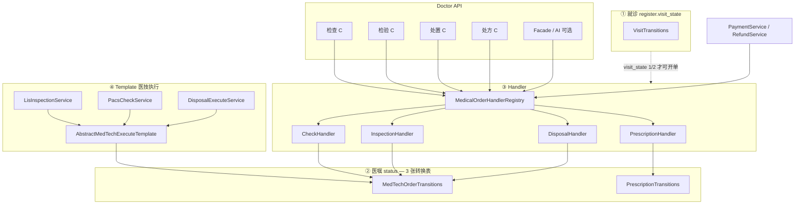
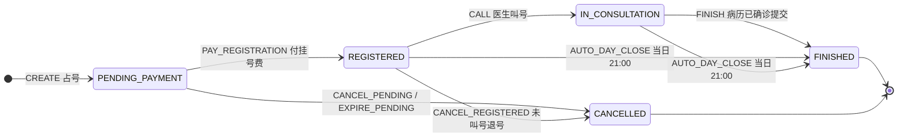
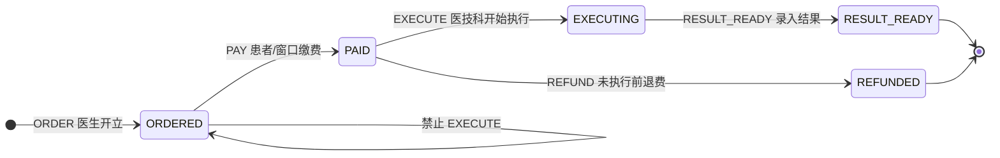
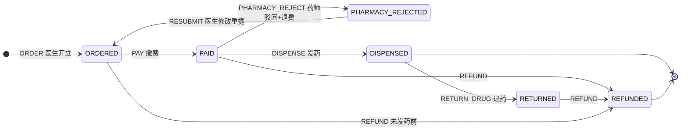
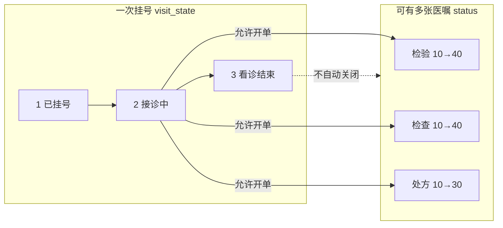
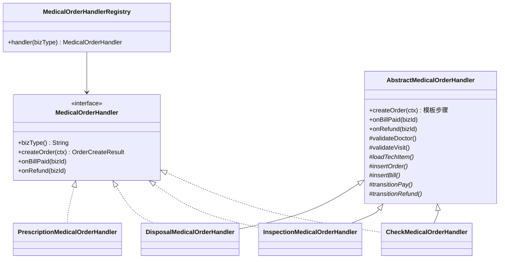
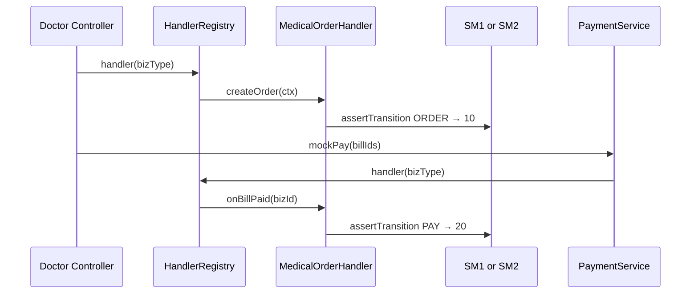
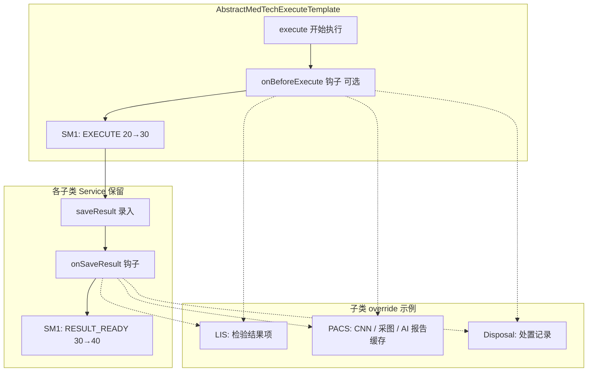

# HIS 领域重构 — 设计模式与分阶段实施（活文档）

> **文档性质**：架构共识稿；**不改变**对外 HTTP 契约（`API.md` 路径与字段保持不变）。  
> **关联**：[`BUSINESS_FLOW.md §八`](./BUSINESS_FLOW.md#八关键状态图老师提供) · [`DATABASE_DESIGN.md §1.5`](./DATABASE_DESIGN.md#15-全局状态枚举实现用-smallint-或-postgresql-enum) · [`DESIGN_DECISIONS.md ADR-018`](./DESIGN_DECISIONS.md) · [`MICROSERVICES.md`](./MICROSERVICES.md)  
> **版本**：v2.4 | 2026-06-30  
> **状态**：🟨 **共识已定稿（实施顺序）** — **代码未开始**，未经 King 明确「开始写代码」不得开工

---

## 〇、实施顺序（King 定稿）

在 **仍是一个 hospital-his 进程**（lis/pacs/disposal 照旧）内，按下面 **四步** 推进；每步完成即跑对应验收脚本。

| 步骤 | 名称 | common / 模块 | 模式 |
|------|------|---------------|------|
| **①** | 就诊状态 | `VisitTransitions` | 轻量状态机 |
| **②** | 医嘱状态 | `MedTechOrderTransitions` + `PrescriptionTransitions` | 轻量状态机 ×2 |
| **③** | 医嘱 Handler | `MedicalOrderHandler` + `MedicalOrderHandlerRegistry` | Handler（开单 + 缴费/退费回调一体） |
| **④** | 医技执行 | `AbstractMedTechExecuteTemplate` | Template Method（单模板 · 三子类） |

```text
① VisitTransitions              → r-min / r-reversal + 叫号·finish 手工
② SM1 + SM2 + Coordinator       → r-lis / r-pacs / r-disposal / r-pharmacy / r-reversal
③ Handler + Registry            → r-min 开单 + r-pharmacy 处方 + Payment/Refund 回调
④ AbstractMedTechExecuteTemplate → 三医技 execute 脚本
```

**原则**：状态机是 **唯一真相**；Handler **发事件 / 调 Transitions**，不在 Handler 里 `if (status==10)`。

**本阶段刻意不做**：每 status 一个 State 子类 · Spring State Machine · 动 Gateway · 新建 Maven 模块（拆 jar 见 §八）。

---

## 一、两层叙述 vs 三套实现

对外讲 **两层**，代码落 **三张转换表** — 避免「五层模式叠罗汉」。

| 层次 | 叙述（业务） | 代码（Transitions） | 字段 |
|------|--------------|---------------------|------|
| **第 1 层** | 一次挂号 / 就诊生命周期 | `VisitTransitions` | `register.visit_state` |
| **第 2 层** | 各类医嘱各自走完 | `MedTechOrderTransitions`（检验/检查/处置 **共用**） | `*_request.status` |
| **第 2 层** | 处方（含药师驳回 15） | `PrescriptionTransitions` | `prescription.status` |

- **叙述 2 层**：就诊 + 医嘱。  
- **实现 3 表**：Visit · MedTech（SM1）· Prescription（SM2）。  
- **开单、缴费、退费** 不归入「第三层状态」，统一由 **步骤 ③ Handler** 驱动 SM1/SM2 事件。  
- **医技 execute** 不归入「第四层状态」，统一由 **步骤 ④ 单模板三子类** 在 lis/pacs/disposal 内调 SM1。

---

## 二、总览架构图



---

## 三、模式维度总表

| 维度 | 用在哪 | 不要用在哪 |
|------|--------|------------|
| **轻量状态机** | **①** `visit_state` · **②** 医嘱 `status`（SM1 三表共用，SM2 处方单独） | 不要检验/检查/处置 **各建一套** SM；不要每 status 一个 State 类 |
| **Handler** | **③** `createOrder()` · `onBillPaid()` · `onRefund()` — **开单与缴费回调同一 Handler** | 不拆成 `OrderCreationStrategy` + `BillSettlementStrategy` 两套接口；不手写 status 迁移 |
| **Template Method** | **④** **一个** `AbstractMedTechExecuteTemplate`，LIS / PACS / Disposal **三子类** | **不再**单独挂 HIS 开单用的 `AbstractOrderCreationTemplate` 对外模式名（开单骨架可作 Handler 基类 **内部** 实现） |
| **Registry** | `MedicalOrderHandlerRegistry` 按 `BillBizType` / 医嘱类型选型 | 处方 **必须** 经 Registry，**禁止** C4 直连 Service 绕开 |

---

## 四、状态机设计（① + ②）

采用 **转换表 + `assertTransition(from, event)`**（`hospital-common`），各服务通过 **Coordinator** 写库。  
下图 **三张** 分别对应三个 Transitions 类（就诊 1 张 + 医嘱 2 张）。

### 4.1 图 1 · `VisitTransitions` — `register.visit_state`

与 [`BUSINESS_FLOW.md §8.1`](./BUSINESS_FLOW.md#81-挂号患者状态图)、[`VisitState`](../../hospital-backend/hospital-common/src/main/java/com/hospital/common/constant/VisitState.java) 一致。

| 值 | 常量 | 含义 |
|----|------|------|
| 0 | `PENDING_PAYMENT` | 待支付（占号，10 分钟超时） |
| 1 | `REGISTERED` | 已挂号 |
| 2 | `IN_CONSULTATION` | 接诊中（已叫号） |
| 3 | `FINISHED` | 看诊结束 |
| 4 | `CANCELLED` | 已退号 / 已取消 |



**主要事件与现有类（步骤 ① 迁移）**：

| 事件 | from → to | 现有触发点 |
|------|-----------|------------|
| `PAY_REGISTRATION` | 0→1 | `PaymentService`（REGISTER bill） |
| `CANCEL_PENDING` / `EXPIRE_PENDING` | 0→4 | `RegisterLifecycleService` |
| `CALL` | 1→2 | `DoctorQueueService.callPatient` |
| `CANCEL_REGISTERED` | 1→4 | 退号 + `RefundService` |
| `FINISH` | 2→3 | `DoctorQueueService.finishVisit`（守卫：`medical_record.status=2`） |
| `AUTO_DAY_CLOSE` | 1/2→3 | `RegisterLifecycleService.autoDayCloseOne` |

**守卫 / 展示策略**：`RegisterLifecycleSupport`（可退号、cancelHint、10 分钟超时）保留为 **只读策略**，不替代 Transitions。

**步骤 ① 验收**：`r-min-acceptance.ps1` · `r-reversal-acceptance.ps1` · 手工叫号 / finish / 待支付超时。

---

### 4.2 图 2 · `MedTechOrderTransitions` — 检验 / 检查 / 处置（SM1）

**一张转换表**，三张表共用：`inspection_request`、`check_request`、`disposal_request`。  
与 [`BUSINESS_FLOW.md §8.2～8.4`](./BUSINESS_FLOW.md#82-医生开立检查状态图) 一致。

| 值 | 含义 |
|----|------|
| 10 | 已开立 |
| 20 | 已缴费 |
| 30 | 执行中 / 执行完成（实现与 API 文案对齐为「执行中」） |
| 40 | 已出结果 |
| 50 | 已退费 |



> 图中 `ORDERED/PAID/EXECUTING/RESULT_READY/REFUNDED` 对应库表值 **10 / 20 / 30 / 40 / 50**。

**写库职责（步骤 ②）**：

| 事件 | 负责模块 |
|------|----------|
| `ORDER`（→10） | his · Handler `createOrder()`（步骤 ③） |
| `PAY` / `REFUND`（→20 / →50） | his · Handler `onBillPaid()` / `onRefund()` |
| `EXECUTE` / `RESULT_READY` | lis / pacs / disposal · 步骤 ④ Template 内调 SM1 |

---

### 4.3 图 3 · `PrescriptionTransitions` — 处方（SM2）

与 [`BUSINESS_FLOW.md §8.4`](./BUSINESS_FLOW.md#84-医生开立处方状态图) 一致；**比 SM1 多 15 药师驳回**。  
**库存联动**：`drug_info.stock_qty` 与 SM2 **同事务**变更；开立时预扣，退费/退药/驳回时回增（见下表）。

| 值 | 含义 |
|----|------|
| 10 | 已开立 |
| 15 | 药师驳回 |
| 20 | 已缴费 |
| 30 | 已发药 |
| 40 | 已退药 |
| 50 | 已退费 |



> 图中 `ORDERED/PAID/…` 对应库表值 **10 / 20 / 30 / 40 / 50**（15 为药师驳回）。

#### 4.3.1 库存联动（与 SM2 绑定）

**业务规则（King 定稿）**：

1. **门诊医生开立处方（`ORDER` / `RESUBMIT`）**：按处方明细逐行 **`drug_info.stock_qty` 预扣**（`deductStock`）；同一事务内完成 status 迁移与扣减。  
2. **库存不足**：任意一行 `quantity > stock_qty` 时 **拒绝开立**，不写入处方、不生成 bill；接口返回 **`该药品库存不足: {drugName}，当前库存 {stock}`**（前端医生工作站提示同文案）。  
3. **回增库存**：下列事件在同事务内 **`restoreStock`**（按原处方明细数量）：  
   - `REFUND`（含已开立未缴费取消、已缴费未发药退费）  
   - `PHARMACY_REJECT`（药师驳回并退费）  
   - `RETURN_DRUG`（已发药后退药）  
4. **`DISPENSE`（发药）**：**不再二次扣减**（开立时已预扣）；药师发药仅做 status 20→30 与实物出库确认。  
5. **`PAY`（缴费）**：**不变更库存**（预扣已在开立时完成）。  
6. **驳回后改方（status=15，`updatePrescription`）**：仅改明细草稿，**不动库存**；医生 **重提（`RESUBMIT`→10）** 时按新明细重新校验并预扣。  
7. **并发**：扣减/回增须 `findByIdForUpdate` 锁行，与 `PrescriptionHandler` / `PharmacyService` 同一 `@Transactional`。

| SM2 事件 | status 迁移 | `stock_qty` | 负责模块 |
|----------|-------------|-------------|----------|
| `ORDER` | →10 | **预扣**（不足则整单失败） | his · `PrescriptionHandler.createOrder()` |
| `RESUBMIT` | 15→10 | **预扣**（按新明细校验） | his · `PrescriptionHandler` |
| `PAY` | 10→20 | 不变 | his · Handler `onBillPaid()` |
| `PHARMACY_REJECT` | 20→15 | **回增** | his · `PharmacyService` |
| `DISPENSE` | 20→30 | 不变 | his · `PharmacyService` |
| `RETURN_DRUG` | 30→40 | **回增** | his · `PharmacyService` |
| `REFUND` | *→50 | **回增**（若尚未在退药回增） | his · Handler `onRefund()` / Refund |

> **与现网差异（待重构落地）**：当前 `PharmacyService.dispense` 在 **发药时** 才扣减库存，`PrescriptionService.createPrescription` **未**校验库存。步骤 ②③ 实施时按上表迁移，验收 `r-pharmacy` / `r-reversal` 须覆盖「库存不足拒开」「驳回/退费/退药回库」。

**写库职责（步骤 ②）**：

| 事件 | 负责模块 |
|------|----------|
| `ORDER` / `RESUBMIT` | his · `PrescriptionHandler`（含库存守卫 + 预扣） |
| `PAY` / `REFUND` | his · Handler 回调（`REFUND` 含回库） |
| `PHARMACY_REJECT` / `DISPENSE` / `RETURN_DRUG` | his · `PharmacyService`（将来 → hospital-pharmacy） |

**步骤 ② 验收**：`r-lis` · `r-pacs` · `r-disposal` · `r-pharmacy` · `r-reversal`；common 单测覆盖非法迁移（如 10 直接 EXECUTE、20 重复 PAY）；**手工**：库存 0 时医生开药被拒、驳回/退费/退药后 `stock_qty` 恢复。

---

### 4.4 就诊与医嘱两条线如何协作



- **开单守卫**：`visit_state ∈ {1, 2}`（与现有 `*OrderService` 一致）。  
- **finishVisit → 3** 不撤销已开医嘱；医嘱各自走完 SM1/SM2。

---

## 五、Handler 设计（步骤 ③）

### 5.1 类图（概念）



> `AbstractMedicalOrderHandler` 内部用 **模板方法** 固定开单骨架；对外统一称 **Handler**，不再单独暴露 `OrderCreationStrategy` / `BillSettlementStrategy` 两套接口名。

### 5.2 运行时流程（开单 + 缴费）



**共识**：

- **四种 Handler**：Check · Inspection · Disposal · Prescription；**开单 + 缴费 + 退费** 均在同一实现类。  
- 医技三类：基类 **模板步骤** + 子类 **钩子**（表、Repository、`BillBizType`）。  
- 处方：`PrescriptionMedicalOrderHandler` 独立（多行明细；create / updateRejected / resubmit）；**`ORDER`/`RESUBMIT` 内校验库存并预扣 `stock_qty`**，不足则整单失败。  
- `PaymentService` / `RefundService`：**消灭** bizType 长 if-else，改为 `registry.handler(bizType).onBillPaid(...)` / `onRefund(...)`；处方 **`onRefund` 须回增库存**（若退药路径已回增则幂等跳过）。  
- AI / Facade 确认落库：`registry.handler(bizType).createOrder(...)`（接口预留）。  
- **替换目标**：`InspectionOrderService` / `CheckOrderService` / `DisposalOrderService` 重复代码 + Payment/Refund 分支。

**步骤 ③ 验收**：`r-min`（开单）· `r-pharmacy` · 驳回改方重提手工。

---

## 六、Template Method — 医技执行（步骤 ④）

### 6.1 范围：只统一 execute，saveResult 各模块保留差异

| 项 | 共识 |
|----|------|
| **抽象类** | **一个** `AbstractMedTechExecuteTemplate`（common 或共享模块） |
| **三子类** | `LisInspectionService` · `PacsCheckService` · `DisposalExecuteService` **继承** |
| **模板内** | 主要统一 **`execute`（20→30）** + SM1 `EXECUTE` |
| **子类保留** | `saveResult` 各模块差异大，**不强行**整段进模板；共用 SM1 `RESULT_READY`（30→40） |
| **与 Handler 关系** | Handler 管 his **开单/缴费**；Template 管 lis/pacs/disposal **执行**，职责分离 |

### 6.2 执行模板流程图



**共识**：子类 **禁止** 复制整段 execute 中的 status 校验与 SM1 调用；status 变更 **只经 SM1**。

**步骤 ④ 验收**：`r-lis-acceptance` · `r-pacs-acceptance` · `r-disposal-acceptance`。

---

## 七、分步实施清单

### 步骤 ① · VisitTransitions（common + his，约 1～2 天）

| 新增（common） | `VisitEvent` · `VisitTransitions` · `VisitTransitionException` |
| 新增（his） | `VisitLifecycleCoordinator` — **唯一**写 `visit_state` 的入口 |
| 迁移 | `PaymentService`（REGISTER）· `RegisterLifecycleService` · `DoctorQueueService` · 退号/refund |
| 不动 | 医嘱 status · Handler · 医技 execute |

### 步骤 ② · SM1 + SM2（common + 全链路，约 2～3 天）

| 新增（common） | `MedTechOrderEvent` · `MedTechOrderTransitions` · `PrescriptionEvent` · `PrescriptionTransitions` |
| 新增 | `OrderStatusCoordinator`（或分 Visit / MedTech / Prescription 三个 Coordinator） |
| 迁移 | `PaymentService` / `RefundService`（医技+处方 bill）· `PharmacyService` · lis/pacs/disposal execute/result |
| 单测 | 非法迁移在 common 一层覆盖 |

### 步骤 ③ · MedicalOrderHandler（his，约 3～5 天）

| 新增 | `order.handler.*` · `AbstractMedicalOrderHandler` · `MedicalOrderHandlerRegistry` |
| 替换 | 三个 `*OrderService` · `PrescriptionService` 开单路径 · Payment/Refund 改调 Registry |
| 包结构 | `controller.patient/registrar/pharmacy` 包名不变，为将来拆 jar 做准备 |

### 步骤 ④ · AbstractMedTechExecuteTemplate（lis/pacs/disposal，约 2～3 天）

| 新增 | common 或共享模块：`AbstractMedTechExecuteTemplate` |
| 迁移 | `LisInspectionService` · `PacsCheckService` · `DisposalExecuteService` 继承并瘦身 execute |

---

## 八、目标包结构（编码参考）

```text
hospital-common/
  com.hospital.common.visit/
    VisitTransitions.java                      # 步骤 ①
  com.hospital.common.order/
    MedTechOrderTransitions.java               # 步骤 ② 图2
    PrescriptionTransitions.java               # 步骤 ② 图3
  com.hospital.common.execute/
    AbstractMedTechExecuteTemplate.java        # 步骤 ④

hospital-his/
  com.hospital.his.visit/
    VisitLifecycleCoordinator.java             # 步骤 ①
  com.hospital.his.order.state/
    OrderStatusCoordinator.java                # 步骤 ②
  com.hospital.his.order.handler/              # 步骤 ③
    MedicalOrderHandler / AbstractMedicalOrderHandler / Registry / 四实现类
```

---

## 九、阶段③ — 微服务拆分（模式重构完成之后）

> 拆分 = 剪切粘贴 + Feign；先完成步骤 ①～④。拆分前更新 `MICROSERVICES.md`、**ADR-019**。

| 服务 | 路由 | 写归属 |
|------|------|--------|
| hospital-patient | `/patient/**` `/registrar/**` | register · bill · payment · **VisitCoordinator** · Handler 缴费驱动 SM1/SM2 |
| hospital-his（临床） | `/doctor/**` | medical_record · Handler 开单 · visit CALL/FINISH |
| hospital-pharmacy | `/pharmacy/**` | SM2：DISPENSE / PHARMACY_REJECT / RETURN |

迁移顺序建议：**pharmacy → patient → 瘦身 clinical his**。

---

## 十、已定稿共识

| 日期 | 结论 |
|------|------|
| 2026-06-30 | 处方 SM2：**开立预扣库存**，退费/驳回/退药 **回增**；库存不足 **拒开** |
| 2026-06-30 | 叙述 **2 层**（就诊 + 医嘱），实现 **3 张转换表**（Visit / MedTech / Prescription） |
| 2026-06-30 | 实施顺序：**① visit_state → ② SM1+SM2 → ③ Handler → ④ AbstractMedTechExecuteTemplate** |
| 2026-06-30 | 开单 + 缴费/退费：**同一 `MedicalOrderHandler`**，经 Registry 选型 |
| 2026-06-30 | 医技执行：**单模板三子类**；主要统一 execute，saveResult 各模块保留 |
| 2026-06-30 | 轻量表驱动状态机；**不**用 State 子类 / Spring State Machine |
| 2026-06-30 | 步骤 ①～④ **不动 Gateway、不新建 Maven 模块** |

---

## 十一、进度（活文档）

| 步骤 | 状态 | 验收 |
|------|------|------|
| ① VisitTransitions | 🟨 | common + Coordinator 已落地；验收 r-min/r-reversal 待跑 |
| ② SM1 + SM2 | 🟨 | Transitions + Coordinator 已落地；验收 r-lis/pacs/disposal/pharmacy/reversal 待跑 |
| ③ MedicalOrderHandler | 🟨 | Handler + Registry 已落地；验收 r-min 开单 · r-pharmacy 待跑 |
| ④ MedTechExecute Template | ⬜ | 三医技 acceptance |
| ⑧ 拆微服务 | ⬜ | ADR-019 后分批 |

---

## 十二、修订记录

| 版本 | 日期 | 说明 |
|------|------|------|
| v2.4 | 2026-06-30 | 处方 SM2 增加 **库存联动**（开立预扣、退费/退药/驳回回增、不足拒开）；§4.3.1 |
| v2.3 | 2026-06-30 | **2 层叙述 + 3 表实现**；Strategy 双接口合并为 **Handler + Registry**；**单模板三子类**（execute 范围）；修订日期改 **年月日** |
| v2.2 | 2026-06-04 | visit 最先；三张状态图 + Strategy 类图/时序 + 执行 Template 流程；四步实施顺序定稿 |
| v2.1 | 2026-06-03 | 合并组内 2-A/2-B/2-C 讨论稿 |
| v2.0 | 2026-06-02 | King flowchart |
| v1.0 | 2026-06-01 | 初稿 |
